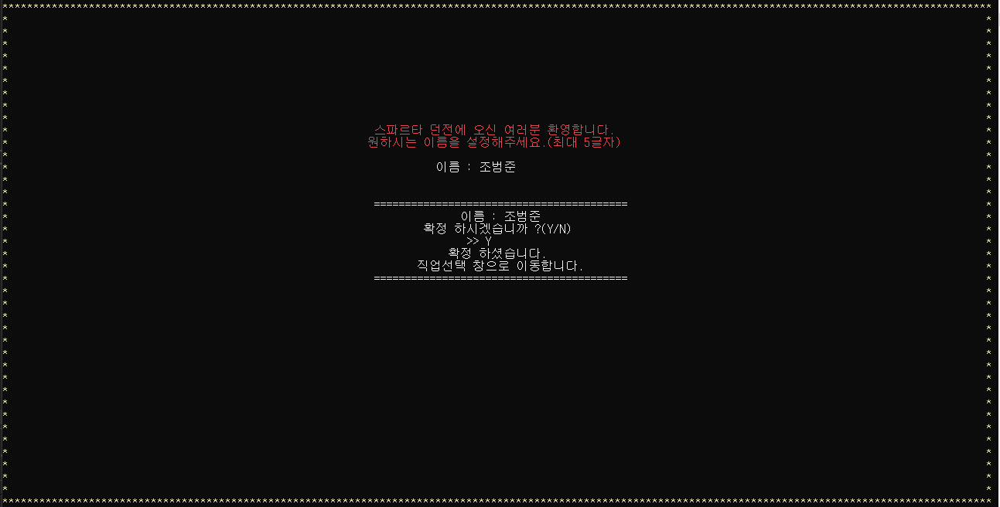
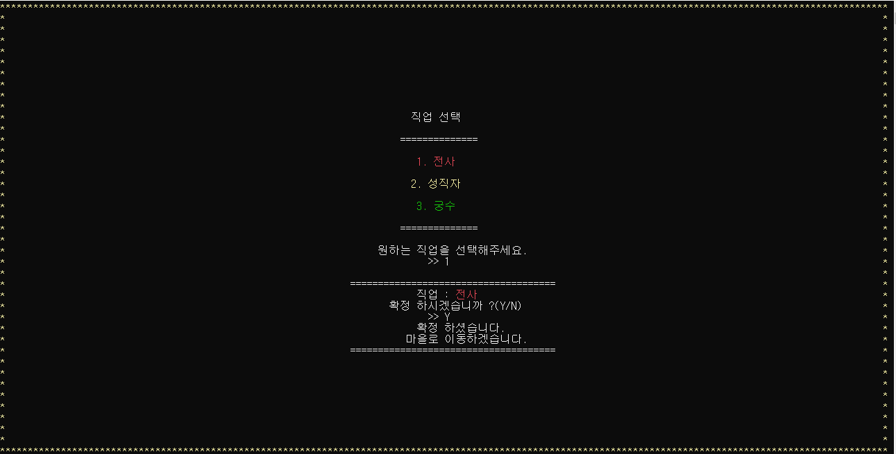
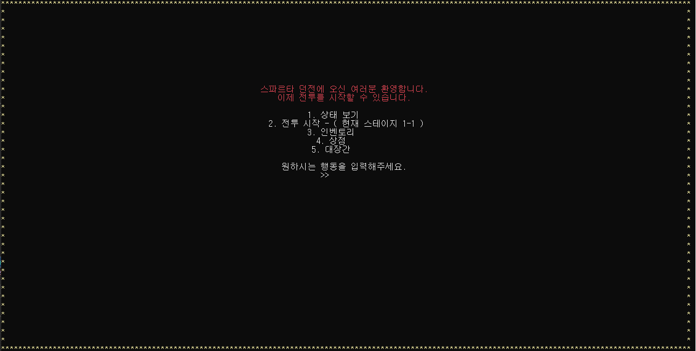
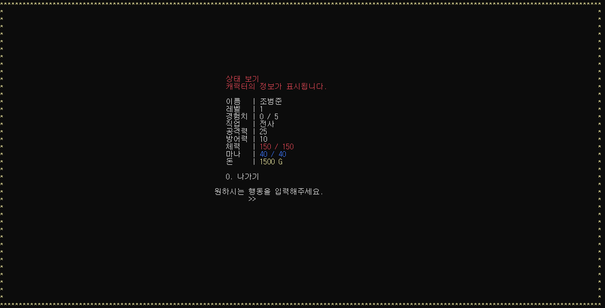
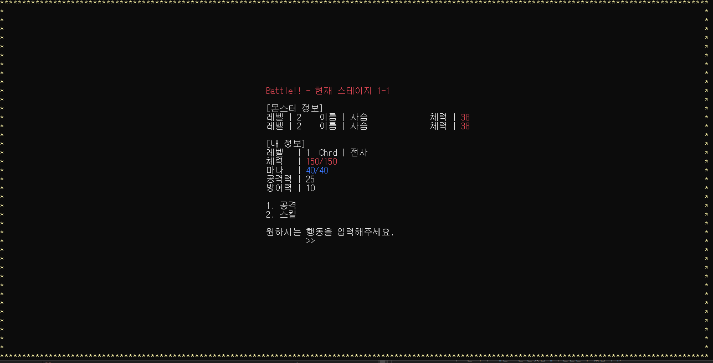
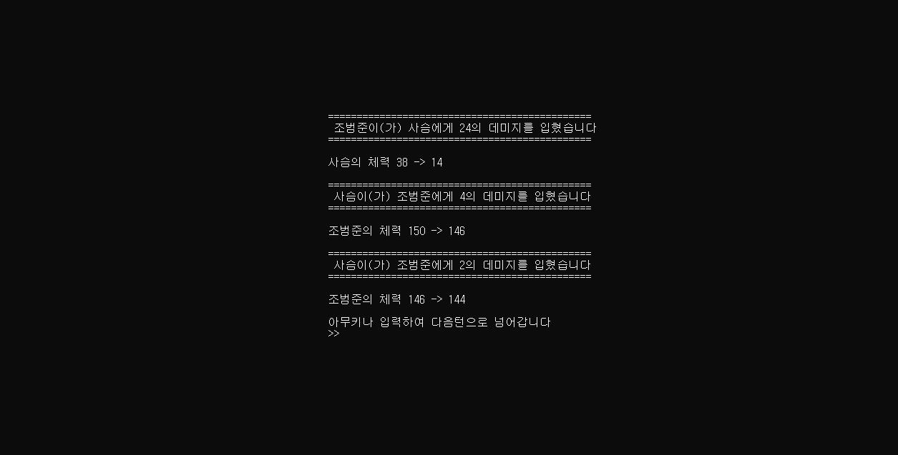
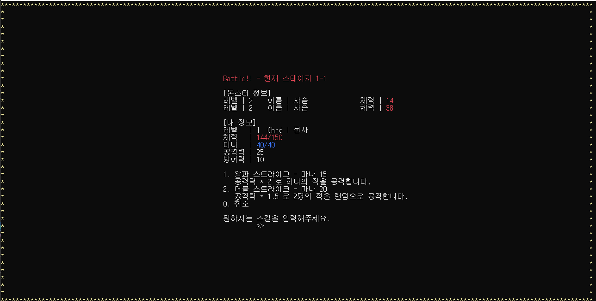
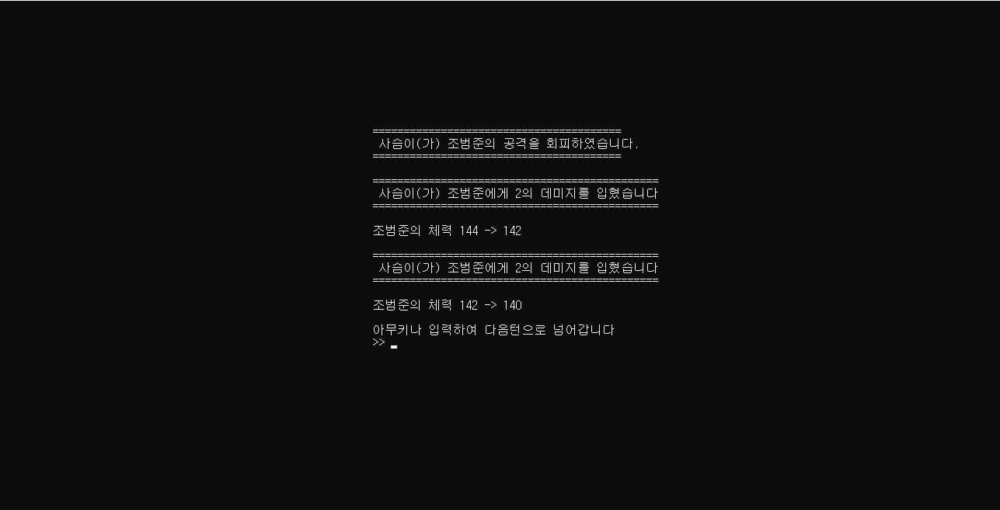

# 스파르타 B12조

- 팀장 조범준
- 팀원 김민태
- 팀원 신현주
- 팀원 지민규

# 게임시연

<htr>https://www.youtube.com/watch?v=1MdGLlin0U8&feature=youtu.be

# 게임설명

## 게임 간단 요약

 - 스파르타 던전에 오신 여러분들 환영합니다
   이 게임같은 경우에는 모든것을 숫자 입력으로 해결할수있는 로그라이크 게임입니다

## 게임 시작

 - 해당 창에서 이름을 입력후 직업을 선택합니다

 - 직업 선택이 끝났다면 메인 화면으로 이동하게됩니다

## 메인 화면

 - 스파르타 던전에 초입 부분으로 던전의 앞이라 그런지 몬스터를 상대하기 위한 무기나  포션을 파는 상점과 대장간이 존재하네요 몬스터를 상대하기전에 저의 상태를 알아볼게요

 

 - 역시 초보 모험가라 그런가 초라한 스탯을 나타내는군요 그렇지만 걱정마세요 이 스파르타 던전에서는 당신의 노력만 있다면 얼마든지 강해질수 있답니다.

 - 일단 던전으로 가서 사냥을 진행해볼까요

  - 던전으로 들어가니 사슴 두마리가 나왔군요 몬스터들은 고유의 레벨을 가지고 있지 않고 스테이지에 따라 랜덤하게 설정되는점 알아주세요
  
  - 일단 전투를 진행해볼까요 1번을 눌러 공격대상을 고른후 공격해주세요

  
 
  - 몬스터를 공격후 몬스터에게 데미지를 입었군요 참고로 던전 내에서는 아이템 사용이 불가능해 체력과 마나관리가 힘들다는점 알아주세요.

  - 이번에는 스킬을 사용해봅시다.

  
  
  - 스킬 창에 들어가니 직업 고유의 스킬이 나오는 군요 일단 알파스트라이크르 사용해볼까요

 - 이런! 강력한 스킬을 사용하였지만 사슴이 이를 알아채고 회피하였네요. 일정 확률로 회피가 발동하기 때문에 어느정도 운을 기대할수있겠군요!

 - 이제 사냥을 마무리하고

## 상점 화면

- 이곳은 전투에 도움이 될 아이템을 구매할 수 있는 상점이에요.
- 제시된 아이템을 구매할 뿐만 아니라 내가 가지고 있는 아이템을 팔 수도있고 장비를 강화 할 수 도 있습니다.

- 아이템을 팔 때는 구매했을때의 가격의 50%만 돌려받습니다. 중고상품이니까요. 
- 아이템을 강화할 때는 1프로의 확률로 아이템이 파괴될 수 있으니 조심하세요

## 인벤토리 화면

- 이곳은 플레이어가 가지고 있는 아이템들을 보관하고 있는 인벤토리 입니다.
- 장비를 장착하거나 소비 아이템을 사용하실수 있습니다.

##게임 저장,불러오기

- 나가기 버튼을 누를 시 현재 플레이어의 정보가 csv파일에 저장 됩니다.

- 

- 불러오기 버튼을 누를 시 현재 저장된 플레이어의 정보를 불러옵니다.
- 불러올 파일이 없다면 바로 새로시작 합니다.

